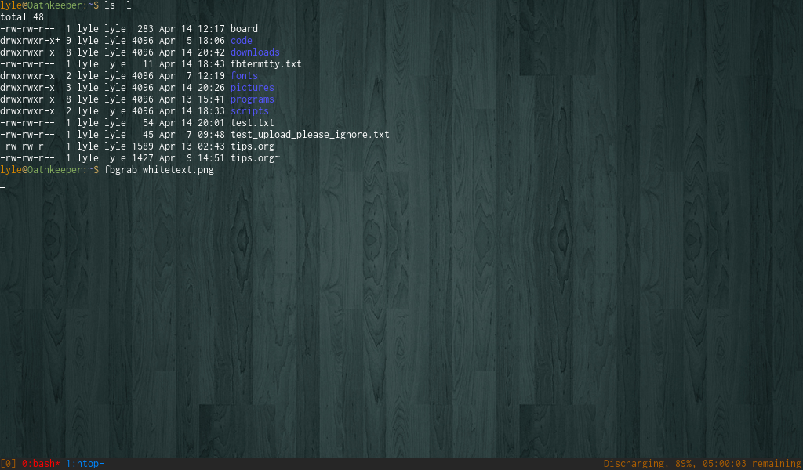

256color-tmux-tty
=================

Files I use to run tmux with 256 colors in tty1 (No X session). Only uses ~60MB of RAM!

Requirements
============

fbterm (Using version 1.7 [recommended])

tmux (Using 1.9a [recommended])

References
==========
Wallpaper: http://wallbase.cc/wallpaper/738726

Tmux theme (Solarized-Dark): https://github.com/seebi/tmux-colors-solarized

Vim Theme (Molokai): https://github.com/tomasr/molokai

Font (Inconsolata): http://levien.com/type/myfonts/inconsolata.html

fbterm-bi: found in man page, or https://wiki.archlinux.org/index.php/Fbterm#Background_image

fbgrab (framebuffer screenshots): http://manpages.ubuntu.com/manpages/lucid/man1/fbgrab.1.html

Useful documentation
====================
Tmux cheat sheet: https://gist.github.com/MohamedAlaa/2961058

Recommended additional programs
===============================

cmus - C MUSic player: https://cmus.github.io/

wicd-curses - wicd (wireless configuration) front end
